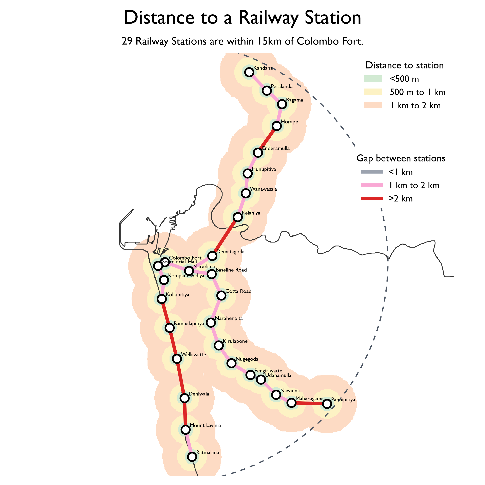

# #COLOMBO'S UNDERUSED RAILWAYS

Personally, I think buses are a more efficient way to improve public transport than trains, light rail, or other expensive new systems.

But we should make much better use of the railway network we already have. There are 29 railway stations within 15 km of Colombo Fort, yet they are underused. Most of Colombo is surprisingly close to a station, but how many of us have ever taken a train for a journey within Colombo?

One fixable problem is that we have a rural railway serving an urban area. On the London Underground, a gap of around 500 m between stops is common. In Colombo, gaps longer than 2 km are not uncommon, even in densely populated areas. Adding a few well-placed stations would be far cheaper and more effective than building entirely new lines.

Capacity is the other problem. Modern signalling could allow many more trains to use the same tracks, potentially even 10x the present frequency. Before reaching for another megaproject, we should ask how much more Colombo could get from the railway it already has.

# SriLanka

